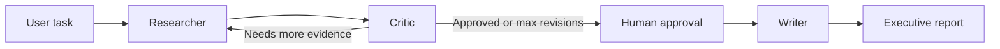

# Omni-Analyst

Omni-Analyst is a Streamlit-based multi-agent research assistant built with LangGraph, Tavily search, and Groq-hosted LLMs. It researches a user request, runs a critic review loop, pauses for human approval, and then drafts an executive report with references.

## Features

- LangGraph workflow with researcher, critic, and writer agents
- Human-in-the-loop approval before final report generation
- Bounded critique/research revisions to prevent runaway loops
- Runtime validation for required API keys
- Streamlit UI and CLI entry point
- Dockerfile, health check, and GitHub Actions compile check

## Architecture



## Requirements

- Python 3.11+
- Groq API key
- Tavily API key

## Local Setup

```bash
python -m venv .venv
.venv\Scripts\activate
pip install -r requirements.txt
copy .env.example .env
```

Fill in `.env`:

```env
GROQ_API_KEY=your_groq_api_key
TAVILY_API_KEY=your_tavily_api_key
```

Run the app:

```bash
streamlit run app/streamlit_app.py
```

Run from CLI:

```bash
python -m app.main "Analyze agentic AI adoption in enterprise analytics" --auto-approve
```

## Deployment

### Streamlit Community Cloud

1. Set the main file path to `app/streamlit_app.py`.
2. Add `GROQ_API_KEY` and `TAVILY_API_KEY` as app secrets.
3. Deploy from `main`.

### Docker

```bash
docker build -t omni-analyst .
docker run --env-file .env -p 8501:8501 omni-analyst
```

## Runtime Configuration

| Variable | Default | Purpose |
| --- | --- | --- |
| `GROQ_API_KEY` | required | Groq model access |
| `TAVILY_API_KEY` | required | Web research access |
| `OMNI_CRITIC_MODEL` | `llama-3.3-70b-versatile` | Critic LLM |
| `OMNI_WRITER_MODEL` | `llama-3.1-8b-instant` | Writer LLM |
| `OMNI_SEARCH_MAX_RESULTS` | `5` | Tavily result count |
| `OMNI_MAX_REVISIONS` | `2` | Maximum research/critic loops |

## Quality Notes

The app intentionally pauses before writing the final report so a human can review the critic feedback. The writer is instructed to avoid invented references and to call out thin evidence explicitly.
